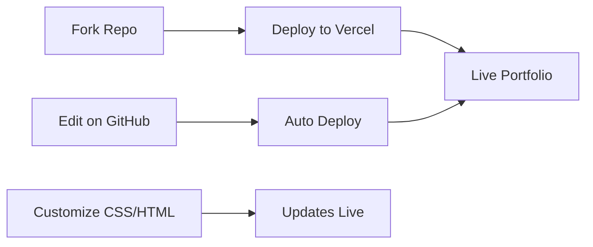

<div align="center">

# 🌟 Personal Portfolio Template

*A modern, sleek portfolio designed to showcase your work and land your next opportunity*

[](https://vercel.com/new/clone?repository-url=https://github.com/MrShadowRIFAT/X8YJHKL-Personal_Portfolio_Template)


**Minimal. Professional. Powerful.**

</div>

---

## ✨ Why This Project

Build a stunning personal portfolio in minutes—no code needed. Impress recruiters, clients, and collaborators with a clean, modern design that highlights your best work.

---

## 🔥 Features

💼 **Professional Design** – Elegant, minimal aesthetic  
⚡ **Lightning Fast** – Optimized performance, instant load  
📱 **Mobile First** – Responsive on all devices  
🎨 **Modern UI** – Smooth animations & transitions  
📸 **Gallery Built-in** – Lightbox & carousel ready  
🔗 **SEO Ready** – Meta tags & semantic markup  
✏️ **Edit on GitHub** – No setup required  

---

## 🚀 Quick Setup

### 1️⃣ Fork Repository
```bash
# Click Fork button on GitHub
# Your own copy is ready
```

### 2️⃣ Deploy with Vercel
Press the button above → Connect GitHub → Deploy (instant!)

### 3️⃣ Local Development
```bash
git clone https://github.com/YOUR_USERNAME/X8YJHKL-Personal_Portfolio_Template.git
cd X8YJHKL-Personal_Portfolio_Template
python -m http.server 8000
# Open http://localhost:8000
```

---

## 📁 Project Structure

| Folder | Purpose |
|--------|---------|
| `css/` | Stylesheets (base, animations, custom) |
| `js/` | JavaScript functionality |
| `img/` | Images & media |
| `svg/` | SVG icons & graphics |
| `modal/` | Modal components |
| `index.html` | Main portfolio page |

---

## 🧠 How It Works



---

## 🛠️ Tech Stack

<div align="center">


</div>

**HTML5** • **CSS3** • **JavaScript** • **jQuery** • **Owl Carousel** • **Magnific Popup**

---

## 📝 Customization

1. **Edit Content** – Update text in `index.html`
2. **Replace Images** – Add your photos to `img/`
3. **Modify Colors** – Change theme in `css/style.css`
4. **Update Meta Tags** – Set title, description, og:image
5. **Add Sections** – Duplicate & modify HTML blocks

---

## 📦 Deployment

| Platform | Time | Cost |
|----------|------|------|
| **Vercel** | < 1 min | Free |
| **GitHub Pages** | 2 mins | Free |
| **Netlify** | 2 mins | Free |
| **Custom Domain** | 5 mins | Paid |

---

## 📊 GitHub Stats

<div align="center">


</div>

---

## 👨‍💼 Author

**MrShadowRIFAT** | [🔗 rifat.website](https://rifat.website) | [📧 noreply@rifat.website](mailto:noreply@rifat.website)

---

<div align="center">

**[⭐ Star This Repo](#)** • **[🐛 Report Issue](#)** • **[💡 Suggest Feature](#)**

Made with ❤️ for professionals

</div>